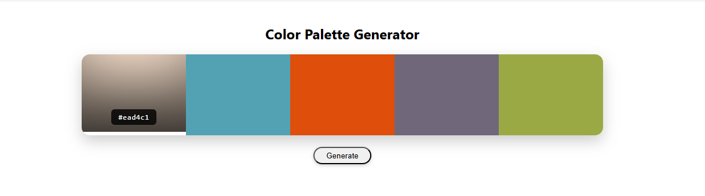
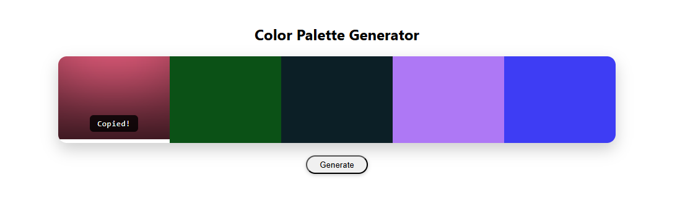

# Color Palette Generator


---

## Overview

A visually interactive web application that generates **random color palettes** for designers and developers.

Users can instantly copy HEX color codes, making it a quick and practical tool for UI design, branding, and creative projects.

---

## Why This Project?

Color selection is essential in:
- UI/UX design  
- Web development  
- Branding & visual identity  
- Creative workflows  

This tool simplifies the process by generating **ready-to-use palettes instantly**.

---

## Features

- Generate random color palettes  
- Display HEX color codes  
- One-click copy to clipboard  
- Smooth and responsive UI  
- Dynamic color rendering  

---

## Preview

### 🔹 Generated Palette


### 🔹 Copy Color Feature


---

## Tech Stack

- HTML5  
- CSS3  
- JavaScript (Vanilla)

---

## How to Run

```bash
git clone https://github.com/your-username/color-palette-generator.git
cd color-palette-generator
```

Then open:
```
index.html
```

## Example

Generated Colors:
```
#FF5733   #33FFBD   #335BFF   #F1C40F   #8E44AD
```

---

## Future Improvements
- Gradient palette generation
- Lock specific colors while regenerating
- Export palettes (image / JSON)
- Dark / light theme support
- Save favorite palettes

---

## What I Learned
Working with dynamic UI updates
Generating random values in JavaScript
Handling clipboard interactions
Designing visually appealing interfaces

---

## Contributing

Pull requests are welcome!
Feel free to enhance features or improve UI.

---

## Show Your Support

If you found this useful, consider giving it a ⭐ on GitHub!
